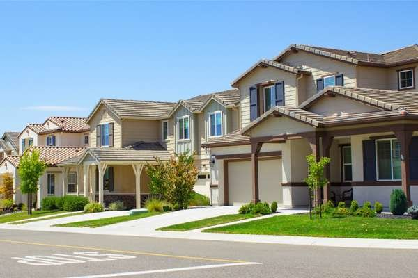
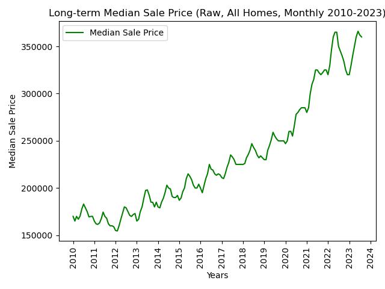
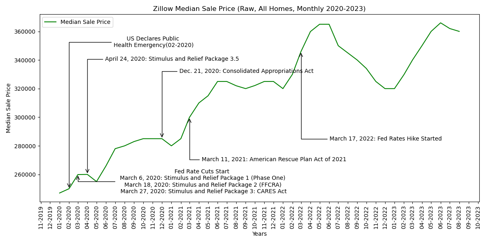

# **United States Interest Rates and Property Market Dynamics**

  
&nbsp; &nbsp; &nbsp; &nbsp;
  

## **Instructions**
**_Please follow these instructions before exploring the analysis:_**

1. Run all of the code blocks in Jupyter Notebook to ensure that all dataframe tables and visualizations are created.

2. To read through the analysis, scroll down to the "Analysis" section of the code blocks.

3. The code blocks are separated into different sections:
   - Import modules
   - Data Tabulation
   - Data Visualization
   - Analysis

4. The visualizations are only visible from the "Analysis" section.

## **Analysis**

  

## **Long-term Median Sale Price**
When examining the trends in the Median Sale Price using Zillow's SRAM indicator, a notable pattern emerges. Between 2010 and 2012, the median sale price in the United States displayed a declining trajectory. However, from 2012 onward, there was a distinct shift towards a sustained upward trend. It's important to emphasize that this upward trajectory was not without interruptions; it featured periodic fluctuations with instances of both decline and recovery. The same trend can be observed when using the BIS Real Property Price Index for the U.S real estate market

Several key insights deserve our attention:

The U.S. housing market was in the process of recovery from the global financial crisis of 2008 and the subsequent housing market crash. As economic conditions improved, consumer confidence surged, spurring greater demand for residential properties.
The stabilization of the economy bolstered consumer confidence. As individuals grew more secure in their financial situations and job prospects, a noticeable uptick in housing market participation was observed.
Real estate investors, including institutional entities, emerged as prominent actors in the market, significantly increasing their property acquisitions. This heightened investor activity amplified demand and intensified competition within the housing sector.
A distinct dip in median property prices became evident in the middle of 2022, aligning with the Federal Reserve's decision to raise interest rates.
Despite these fluctuations, an overall trend emerges, characterized by a consistent long-term growth in median sale prices.

  

## **Median Sale Price during the Pandemic and the Rise of Interest Rates**

Economic Stimulus and Pandemic Impact (March 2020 - May 2020): Median house prices plateaued, reflecting the uncertainty and economic challenges posed by the pandemic, as well as the declaration of a U.S. public health emergency. Buyers and sellers were cautious due to these unprecedented circumstances.

In May 2020, there was a notable change in the trend, as median house prices began to increase. The pandemic brought demands for more space, particularly from young urban households whose family formation moves were greatly accelerated in the wake of the pandemic.

Plateau and Affordability Concerns (June 2021 - February 2022): The plateauing of prices around June 2021 might have been influenced by factors such as affordability concerns and housing market fatigue, especially in markets that had experienced rapid price growth.

Resurgence and Interest Rate Hikes (February 2022 - January 2023): In February 2022, the housing market started to increase again. The anticipation of rising rates might have motivated buyers to enter the market before borrowing costs became more expensive.

The market peaked in June 2022, driven by a combination of factors, including low inventory, strong demand, and increased interest rates.

Decline and Recovery (June 2022 - January 2023): After the peak, there was a period of declining prices, which extended until January 2023. This decline could be attributed to affordability issues, as rising prices and interest rates made it more challenging for some buyers.

Recent Resurgence (January 2023 - June 2023): From January 2023, there was another upswing in median house prices, ultimately reaching the same peak as in June 2022 by June 2023. This resurgence could be attributed to various factors, including improved economic conditions, continued demand for housing, and potential adjustments in the housing market.

## **BIS Real Property Price Index for Australia and the United States and Interest Rates for both countries**

  

### **United States**
The interest rates in the United States have been relatively higher than in Australia over the entire period, with a range from 0.125% to 5.375%. The Real Property Price Index for the United States has generally increased over the years, although it saw some fluctuations. It started around 101 in 2010 and reached approximately 157 in 06-2023. In index terms, it would mean that the same property around 2010 is now 50% more in value. Furthermore, Zillows SRAM indicator which measures the Median Sale Price (Raw, All Homes, Monthly) supports this observations wherein the price from 2010 has almost doubled in 2023.

### **Australia**
The interest rates in Australia also saw variation during the period but remained generally lower than in the United States, with a range from 0.125% to 4.10%. The Real Property Price Index in Australia increased over the years, indicating a general upward trend in property prices. It started around 99 in 2010 and reached approximately 122 in 03-2023. In index terms, it would mean that the same property around 2010 is now 22% more in value.

## **Conclusion**

The United States generally maintained its housing market price uptrend compared to Australia may be due to the following conditions:

Strong economic conditions often lead to higher property prices as people have more disposable income and are more likely to invest in real estate.
Central banks, like the Federal Reserve in the United States and the Reserve Bank of Australia, influence interest rates as a tool to manage inflation and economic growth. Changes in interest rates can affect borrowing costs and property demand.
In the United States, 30-year fixed-rate mortgages are common, providing borrowers with long-term rate stability and smaller monthly payments. In Australia, it's more common to have shorter fixed-rate terms. This difference can affect the sensitivity of the housing market to changes in interest rates.
Longer-term fixed-rate loans in the U.S. may make homeowners less sensitive to short-term interest rate fluctuations, which can dampen the immediate impact of interest rate changes on property prices.
In Australia, where fixed-rate terms are shorter, property prices might respond more quickly to changes in interest rates, as borrowers are exposed to interest rate adjustments more frequently.
The availability of assumable loans in the U.S. can influence the housing market. An assumable loan allows a buyer to take over the seller's existing mortgage at its original terms. This can make homes more attractive to buyers and potentially support property values.
The regression results show the output of an Ordinary Least Squares (OLS) regression model. This model examines the relationship between interest rates in the United States and property prices.

## **OLS Regression Model Explainer**

  

The regression results show the output of an Ordinary Least Squares (OLS) regression model. This model examines the relationship between interest rates in the United States and property prices.

Here's an interpretation of the key elements of the regression results:

**1. R-squared (R²):**

- R-squared measures the goodness of fit of the model, representing the proportion of the variance in the dependent variable (property prices) that can be explained by the independent variable (interest rates). An R-squared value of 0.345 indicates that approximately 34.5% of the variation in property prices can be explained by changes in interest rates. This suggests that interest rates have some influence on property prices, but there are other factors at play as well.

**2. F-statistic:**

- The F-statistic tests the overall significance of the regression model. In this case, the F-statistic is 85.42, and the associated p-value is very close to zero (1.33e-16). This low p-value indicates that the model as a whole is statistically significant, implying that at least one of the independent variables (interest rates) has a significant impact on the dependent variable (property prices).

**3. Coefficients:**

- The coefficient of the "const" term is approximately 2.07e+05. This represents the estimated property price when the United States interest rate is zero. In practical terms, it's the intercept of the regression line.
The coefficient for "United States" interest rates is approximately 2.758e+04. This suggests that for each unit increase in United States interest rates, property prices are estimated to increase by approximately 27,580 units.

**4. P-values:**

- The p-value associated with the "United States" interest rates coefficient is very close to zero, indicating that the interest rates variable is statistically significant. This supports the Alternative Hypothesis (H1) that interest rates have a statistically significant effect on property prices.

**5. Omnibus, Durbin-Watson, Jarque-Bera, Skew, Kurtosis:**

- These statistics are used to assess the assumptions of the regression model. An important point to note is the very low Durbin-Watson statistic (close to zero), which suggests potential issues with autocorrelation in the residuals, meaning that the errors may not be independent over time. This could affect the reliability of the model.

**Notes:**

The standard errors assume that the covariance matrix of the errors is correctly specified. This is an assumption of the OLS model.
