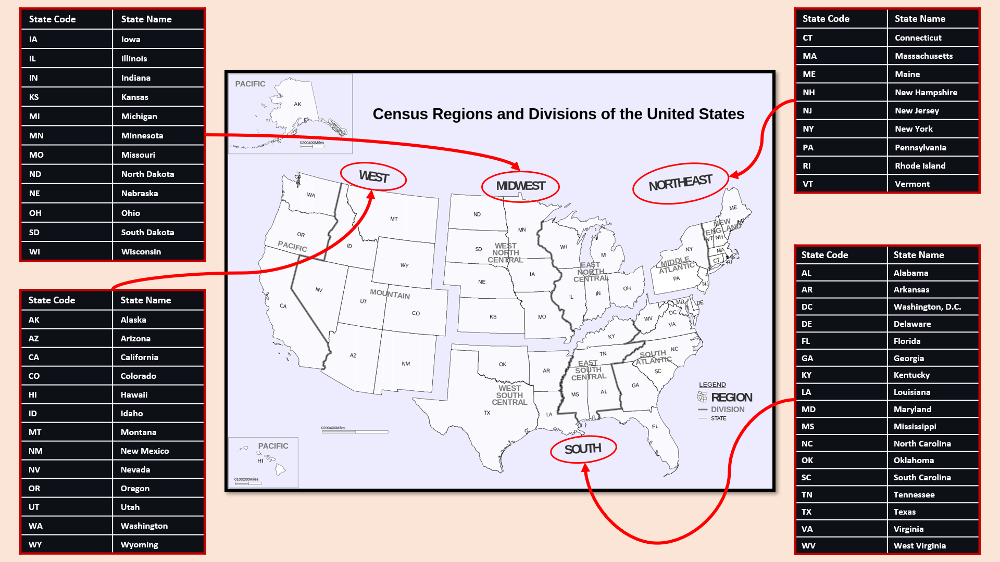
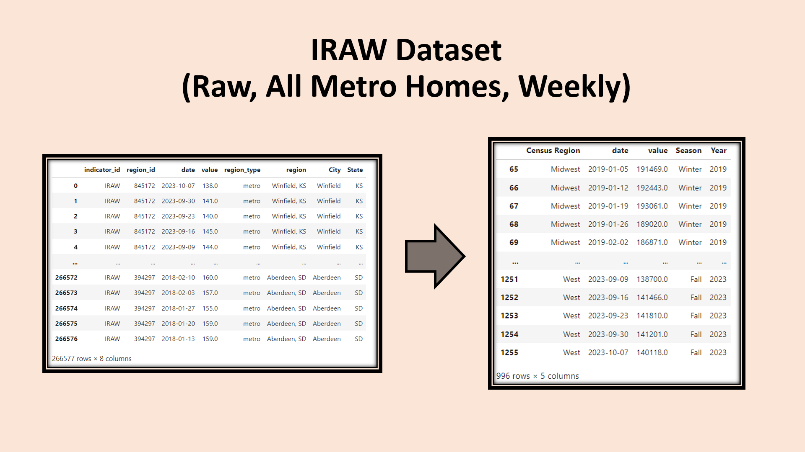
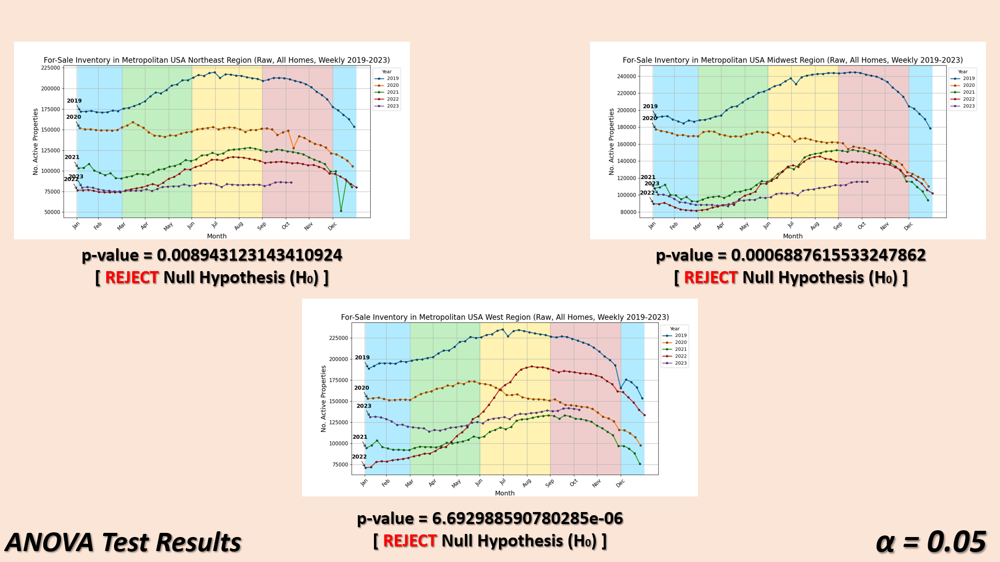
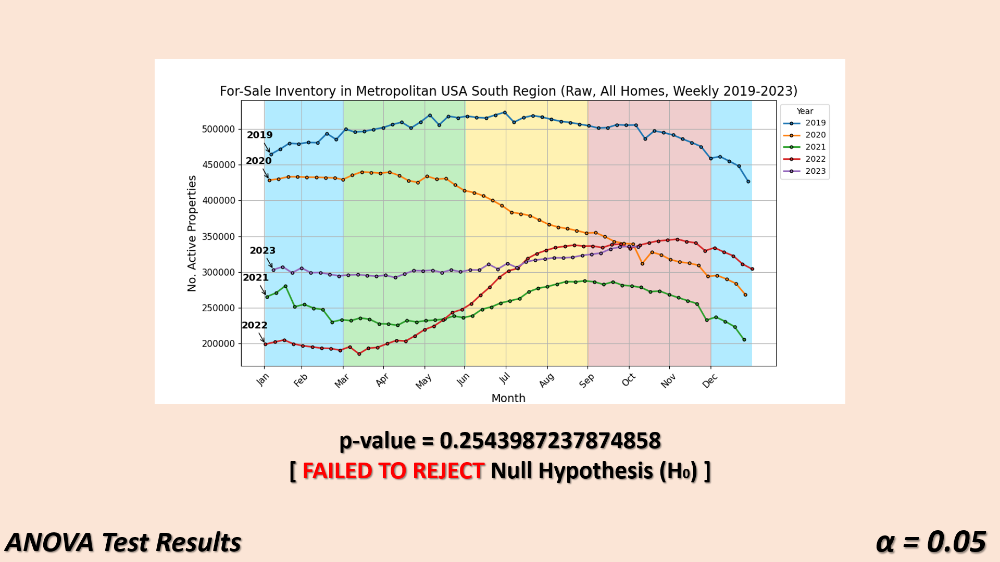
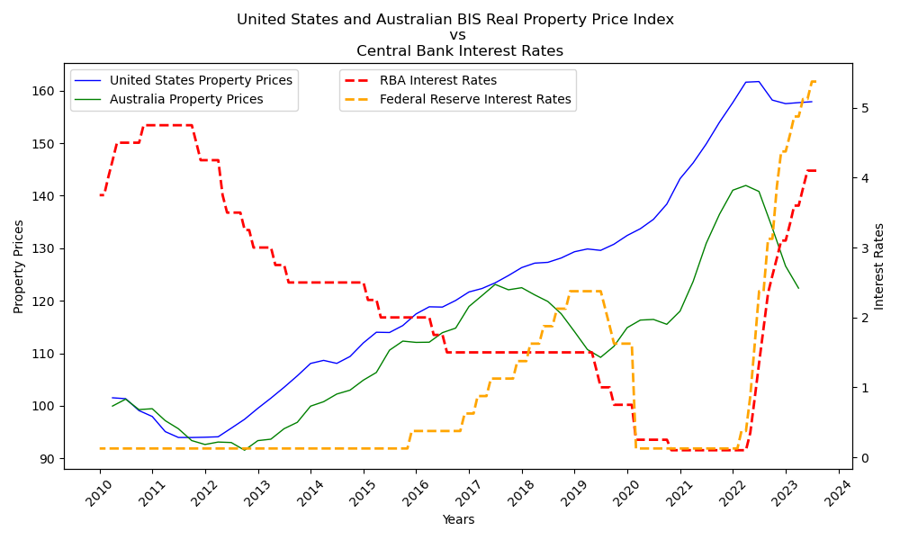
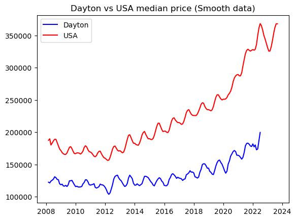
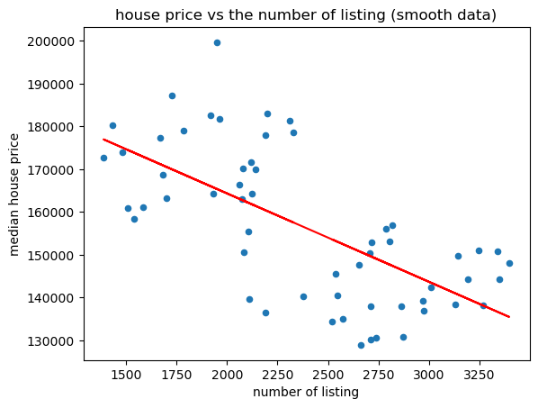
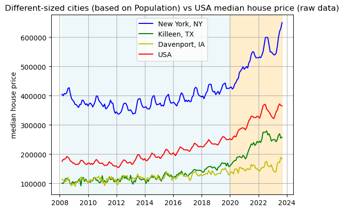
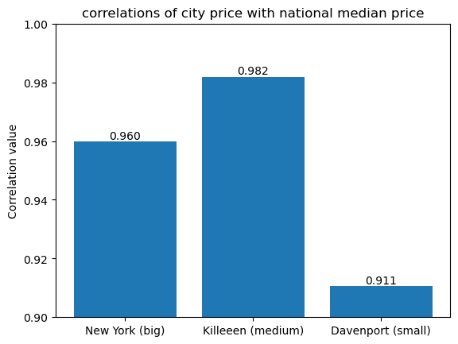

--------------------------------------------------------------------------------------------------------------------------------------------------------------------------
# **Zillow: USA Real Estate Data Analysis**

<p align="center">

</p>

## Project Contributors
 * **Wassim Deen**
    - [Github] https://github.com/wdeen
  * **Gabriel Adriano**
    - [Github] https://github.com/gadriano11
 * **Jun Leng Tan**
    - [Github] https://github.com/bill-leang


## Project Overview
For this project, we explored facets of the Nasdaq Zillow API dataset and performed 3 different analyses to unravel interesting trends in the USA real estate market.
Zillow is regarded as the "leading real estate and rental marketplace" with its API built around various market indicators and containing more than 20 years worth of data for "thousands of geographical areas" covering the United States.

For more information: https://data.nasdaq.com/databases/ZILLOW/documentation

Our analyses explore the following topics:
1. Effect of Seasonal Changes on the Metropolitan Real Estate Inventory (per USA Region)
2. United States Interest Rates and Property Market Dynamics
3. Median House Price Change In Various Cities Over Time

In demonstrating our overall data analysis, we each primarily (but not exclusively) used the following Python libraries:
1. **Pandas** - Data Wrangling / Cleaning / Aggregation / Analysis
2. **Matplotlib** - Visualisations of Our Raw / Aggregated Datasets
3. **SciPy** - Various Statistical & Hypothesis Testing


## Final Repository Structure
```
├── README.md
├── Group6_Project1.html
├── Group6_Project1.ipynb
├── nasdaqdatalinkapikey.txt
├── .gitignore
├── 'Images' Folder
├── 'Resources' Folder
├── 'data' Folder
└── 'Slide Decks' Folder
    ├── GabrielAdriano_SlideDeck.pptx
    └── JunLengTan_SlideDeck.pptx
    └── WassimDeen_SlideDeck.pptx
```

--------------------------------------------------------------------------------------------------------------------------------------------------------------------------

# **Effect of Seasonal Changes on the Metropolitan Real Estate Inventory (per USA Region)**

<p align="center">
  
</p>


## Topic Analysis Overview

The United States is home to many biomes which initially suggests that many large areas of the country would experience varying weather patterns and climate conditions.
By extension, this also suggests that the rise and fall of For-Sale Inventory across the seasons will vary in intensity depending where state-specific markets are loclated in the country.


<p align="center">
  
</p>

As a result, the Region Classification from the United States Census is used to split the country into four large regions:
1. **Northeast** (9 States)
2. **Midwest** (12 States)
3. **South** (17 States including District of Columbia)
4. **West** (13 States)

For more information: https://www2.census.gov/geo/pdfs/maps-data/maps/reference/us_regdiv.pdf


In addition, the Meteorological Definition is followed to define the timeframe of each season within any calendar year:
1. **Winter** (December 1st - February 28th/29th)
2. **Spring** (March 1st - May 31st)
3. **Summer** (June 1st - August 31st)
4. **Autumn/Fall** (September 1st - November 30th)

For more information: https://www.timeanddate.com/calendar/aboutseasons.html


<p align="center">
  
</p>

Using the Zillow Real Estate Data (via Nasdaq Data Link API), I extracted all available raw data of For-Sale Inventory (All Homes) where each data point represents a week for a USA State from late CY 2017 to CY 2023 so far. Each datapoint also represents data for metro region only, which is why the analysis covers exclusively Metropolitan USA.

Over 250,000 data points were collected, cleaned, manipulated and aggregated to form the final dataset used to:
1. Plot a Time-Series Analysis per USA Region (2019-2023)
2. ANOVA Test of For-Sale Inventory Variability Across All Four Seasons per USA Region (2019-2023)

Aside from the average For-Sale Inventory decreasing YoY, parallels across most years (for each USA region) in the time-series analysis plots can be clearly observed in terms of upward & downward trend.
The plots suggest the count of active properties for-sale typically see a gradual, but clear increase from the start of Spring and continues building up until it peaks & plateaus somewhere within the Summer. From there, the numbers gradually fall from the start of Autumn all the way to the end of Winter.

The pattern is especially pronounced across all USA regions in CY 2022, but this could be due to a specific point in the COVID-19 Pandemic where isolation & quarantine regulations were gradually being lifted.
This may have caused a slingshot effect, resulting in dramatic rises and spikes in the For-Sale Inventory across USA.

Conversely, CY 2020 for all USA regions show an overall decline For-Sale Inventory and this could, once more, be due to the COVID-19 Pandemic as that marked its starting point.

For a proper inference on the variability of For-Sale Inventory across all four seasons, ANOVA testing was conducted for each USA region.
In other words, the difference between the means of For-Sale Inventory count for the seasons (per region) is analysed:
1. **Northeast Region** = REJECT Null Hypothesis (H0) i.e. variability of the For-Sale Inventory across seasons IS statistically significant
2. **Midwest Region** = REJECT Null Hypothesis (H0) i.e. variability of the For-Sale Inventory across seasons IS statistically significant
3. **South Region** = FAILED TO REJECT Null Hypothesis (H0) i.e. variability of the For-Sale Inventory across seasons is NOT statistically significant
4. **West Region** = REJECT Null Hypothesis (H0) i.e. variability of the For-Sale Inventory across seasons IS statistically significant


## Null & Alternative Hypotheses / Level of Significance Definitions

### **Null Hypothesis (H0):**

The variability of For-Sale Inventory in the given USA Region across seasons is NOT statistically significant.


### **Alternative Hypothesis (H1):**

The variability of For-Sale Inventory in the given USA Region across seasons IS statistically significant.

### **Level of Significance (α):**

α = 0.05


## USA Northeast Region (Time Series / F-Statistic / p-Value)


- **F-statistic = 3.946703358362805**
- **p-value = 0.008943123143410924**

**[REJECT Null Hypothesis (H0)]** With 95% confidence, the variability of the For-Sale Inventory in the Northeast Region across seasons is statistically significant.

## USA Midwest Region (Time Series / F-Statistic / p-Value)


- **F-statistic = 5.875017566328791**
- **p-value = 0.0006887615533247862**

**[REJECT Null Hypothesis (H0)]** With 95% confidence, the variability of the For-Sale Inventory in the Midwest Region across seasons is statistically significant.

## USA South Region (Time Series / F-Statistic / p-Value)


- **F-statistic = 1.3639286436735938**
- **p-value = 0.2543987237874858**

**[FAILED TO REJECT Null Hypothesis (H0)]** At 5% risk level, the variability of the For-Sale Inventory in the South Region across seasons is NOT statistically significant.

## USA West Region (Time Series / F-Statistic / p-Value)


- **F-statistic = 9.395782823063112**
- **p-value = 6.692988590780285e-06**

**[REJECT Null Hypothesis (H0)]** With 95% confidence, the variability of the For-Sale Inventory in the West Region across seasons is statistically significant.


## ANOVA Test Results (Summary)

<p align="center">
  
&nbsp; &nbsp; &nbsp; &nbsp;
  
</p>

--------------------------------------------------------------------------------------------------------------------------------------------------------------------------
# **United States Interest Rates and Property Market Dynamics**
### Presented by: Gabriel Adriano for Monash Data Bootcamp 2023

<p align="center">
  
&nbsp; &nbsp; &nbsp; &nbsp;
  
</p>

## **Instructions**
**_Please follow these instructions before exploring the analysis:_**

1. Run all of the code blocks in Jupyter Notebook to ensure that all dataframe tables and visualizations are created.

2. To read through the analysis, scroll down to the "Analysis" section of the code blocks.

3. The code blocks are separated into different sections:
   - Import modules
   - Data Tabulation
   - Data Visualization
   - Analysis

4. The visualizations are only visible from the "Analysis" section.


## **Analysis**

<p align="center">
  
</p>

## **Long-term Median Sale Price**
When examining the trends in the Median Sale Price using Zillow's SRAM indicator, a notable pattern emerges. Between 2010 and 2012, the median sale price in the United States displayed a declining trajectory. However, from 2012 onward, there was a distinct shift towards a sustained upward trend. It's important to emphasize that this upward trajectory was not without interruptions; it featured periodic fluctuations with instances of both decline and recovery. The same trend can be observed when using the BIS Real Property Price Index for the U.S real estate market

Several key insights deserve our attention:

The U.S. housing market was in the process of recovery from the global financial crisis of 2008 and the subsequent housing market crash. As economic conditions improved, consumer confidence surged, spurring greater demand for residential properties.
The stabilization of the economy bolstered consumer confidence. As individuals grew more secure in their financial situations and job prospects, a noticeable uptick in housing market participation was observed.
Real estate investors, including institutional entities, emerged as prominent actors in the market, significantly increasing their property acquisitions. This heightened investor activity amplified demand and intensified competition within the housing sector.
A distinct dip in median property prices became evident in the middle of 2022, aligning with the Federal Reserve's decision to raise interest rates.
Despite these fluctuations, an overall trend emerges, characterized by a consistent long-term growth in median sale prices.


<p align="center">
  
</p>

## **Median Sale Price during the Pandemic and the Rise of Interest Rates**

Economic Stimulus and Pandemic Impact (March 2020 - May 2020): Median house prices plateaued, reflecting the uncertainty and economic challenges posed by the pandemic, as well as the declaration of a U.S. public health emergency. Buyers and sellers were cautious due to these unprecedented circumstances.

In May 2020, there was a notable change in the trend, as median house prices began to increase. The pandemic brought demands for more space, particularly from young urban households whose family formation moves were greatly accelerated in the wake of the pandemic.

Plateau and Affordability Concerns (June 2021 - February 2022): The plateauing of prices around June 2021 might have been influenced by factors such as affordability concerns and housing market fatigue, especially in markets that had experienced rapid price growth.

Resurgence and Interest Rate Hikes (February 2022 - January 2023): In February 2022, the housing market started to increase again. The anticipation of rising rates might have motivated buyers to enter the market before borrowing costs became more expensive.

The market peaked in June 2022, driven by a combination of factors, including low inventory, strong demand, and increased interest rates.

Decline and Recovery (June 2022 - January 2023): After the peak, there was a period of declining prices, which extended until January 2023. This decline could be attributed to affordability issues, as rising prices and interest rates made it more challenging for some buyers.

Recent Resurgence (January 2023 - June 2023): From January 2023, there was another upswing in median house prices, ultimately reaching the same peak as in June 2022 by June 2023. This resurgence could be attributed to various factors, including improved economic conditions, continued demand for housing, and potential adjustments in the housing market.

## **BIS Real Property Price Index for Australia and the United States and Interest Rates for both countries**

<p align="center">
  
</p>

### **United States**
The interest rates in the United States have been relatively higher than in Australia over the entire period, with a range from 0.125% to 5.375%. The Real Property Price Index for the United States has generally increased over the years, although it saw some fluctuations. It started around 101 in 2010 and reached approximately 157 in 06-2023. In index terms, it would mean that the same property around 2010 is now 50% more in value. Furthermore, Zillows SRAM indicator which measures the Median Sale Price (Raw, All Homes, Monthly) supports this observations wherein the price from 2010 has almost doubled in 2023.

### **Australia**
The interest rates in Australia also saw variation during the period but remained generally lower than in the United States, with a range from 0.125% to 4.10%. The Real Property Price Index in Australia increased over the years, indicating a general upward trend in property prices. It started around 99 in 2010 and reached approximately 122 in 03-2023. In index terms, it would mean that the same property around 2010 is now 22% more in value.


## **OLS Regression Model Explainer**

<p align="center">
  
</p>

### **Null Hypothesis (H0):**

There is no statistically significant relationship between changes in interest rates and property prices in the United States.

### **Alternative Hypothesis (H1):**
There is a statistically significant relationship between changes in interest rates and property prices in the United States.

### **Results:**

**P-value for the 'interest rate' coefficient:** 1.3320868257407982e-16
**Critical F-value at alpha** = 0.05: 3.899502435176602

**F-statistic:** 85.42 is much larger than Critical F-value: 3.8995, it indicates that the model is statistically significant at the 0.05 significance level.

This suggests that interest rates has a statistically significant effect on the property prices. This is a strong indication that the regression model is meaningful and that the independent variables collectively explain a significant portion of the variation in property prices.

**Reject the null hypothesis. Interest rates have a statistically significant effect on property prices.**

The regression results show the output of an Ordinary Least Squares (OLS) regression model. This model examines the relationship between interest rates in the United States and property prices.

**_Here's an interpretation of the key elements of the regression results:_**

**1. R-squared (R²):**

- R-squared measures the goodness of fit of the model, representing the proportion of the variance in the dependent variable (property prices) that can be explained by the independent variable (interest rates). An R-squared value of 0.345 indicates that approximately 34.5% of the variation in property prices can be explained by changes in interest rates. This suggests that interest rates have some influence on property prices, but there are other factors at play as well.

**2. F-statistic:**

- The F-statistic tests the overall significance of the regression model. In this case, the F-statistic is 85.42, and the associated p-value is very close to zero (1.33e-16). This low p-value indicates that the model as a whole is statistically significant, implying that at least one of the independent variables (interest rates) has a significant impact on the dependent variable (property prices).

**3. Coefficients:**

- The coefficient of the "const" term is approximately 2.07e+05. This represents the estimated property price when the United States interest rate is zero. In practical terms, it's the intercept of the regression line.
The coefficient for "United States" interest rates is approximately 2.758e+04. This suggests that for each unit increase in United States interest rates, property prices are estimated to increase by approximately 27,580 units.

**4. P-values:**

- The p-value associated with the "United States" interest rates coefficient is very close to zero, indicating that the interest rates variable is statistically significant. This supports the Alternative Hypothesis (H1) that interest rates have a statistically significant effect on property prices.

**5. Omnibus, Durbin-Watson, Jarque-Bera, Skew, Kurtosis:**

- These statistics are used to assess the assumptions of the regression model. An important point to note is the very low Durbin-Watson statistic (close to zero), which suggests potential issues with autocorrelation in the residuals, meaning that the errors may not be independent over time. This could affect the reliability of the model.

**Notes:**
The standard errors assume that the covariance matrix of the errors is correctly specified. This is an assumption of the OLS model.

--------------------------------------------------------------------------------------------------------------------------------------------------------------------------

# **Median House Price Change In Various Cities Over Time**


## Guidelines on Jupyter notebook code (Jun Leng Tan section, third section)

1. Run all of the cells sequentially in Jupyter Notebook to ensure that all dataframes and visualizations are created.

2. Each visualization is generally followed by an explanation or analysis, sometimes the write-up is in the next figure as they are compared together.

   
## About the datasets used: sssm_combine, srsm_combine, issm, irsm
  ### sssm_combine
  - It contains smoothed data metropolitan area monthly median house price over the years ( in each state as well as the whole of US (region = 'United States') (90705 rows x 8 columns)  joined with the region info (a table of 89,305 rows by 3 columns).
  - The date range may defer from city to city.   
  - Different states have different numbers of metro area (AK, Alaska, only has 1, CA, california, has 34.  
  - The difference between smoothed and raw data on Zillow is that the former removes 'spikes' in the raw data to make the chart look 'smoother', which is fine for our purpose. Data wise, the smoothed data will have their tail components adjusted to give the graph a "smoother" appearance, otherwise the raw data may have many "steps" or small flat lines. (e.g 130,750 (smooth) vs 130,000 (raw)). According to Zillow, the adjustment may also be for seasonal reason.  
      - The raw data also have slightly more data points than the smoothed data (93075 vs 92558, 0.56% less).  
      - Raw data also has State typo (eg. "NC; NC"), which may be introduced during data input.
  ### srsm_combine
  - It is the counterpart of sssm_combine but with raw data
  ### issm
  For-Sale Inventory (number of listings) (Smooth, SFR only, Monthly) (61919 rows × 4 columns)
  ### irsm
  For-Sale Inventory (number of listings) (Raw, SFR only, Monthly) (61919 rows × 4 columns)

## Finding on Smooth vs Raw data sets  
- The raw data has more spikes compared to the smooth data (thus the name 'smooth')
- As expected the correlation also dropped slightly (0.95 for smooth to 0.93 for raw)

<p align="center">
  
&nbsp; &nbsp; &nbsp; &nbsp;
  
</p>


## Finding on linear regression for smooth vs raw
- From the graph we can see that there is generally a negative correlation between the house price and number of listing. This makes sense from a supply-demand perspective. As the more supply (listing) there is, the lower the price will be given the same demand. The r-squared value is significant, meaning the regression model is quite reliable.  
    - Comparing the smooth to raw, the smooth data has higher r-squred value (0.43 vs 0.26), meaning the linear regression model using smoothed data is more predictable, because the data seems to have been 'compacted' during the smoothing process as we can see the data points are closer together to the regression line in the smooth dataset.

<p align="center">
  
&nbsp; &nbsp; &nbsp; &nbsp;
  
</p>

## Explanation  
  The locations of the cities that we have chosen as the representation of the 3 city sizes (big, medium, small). The size of the dot indicates the median house price in each city.
<p align="center">
  
&nbsp; &nbsp; &nbsp; &nbsp;
</p>

## Finding on different sized cities compared to national house price trend
- As expected the big city has the highest price, followed by medium and finally the small city.
- One would expect the big city to have a higher correlation with national price than the smaller ones, because they have a bigger weight when compared to the smaller cities in the calculation of the national price, but it turned out that Killeen (a medium city) has the highest correlation (0.982) vs big city New York's 0.957 and small city Davenport's 0.911. This could be because the national price is a median price which is closest to the medium sized city's price (50th percentile price). As it can be reasonably assumed that when ranked by price, the bigger the city the higher its median price.
- House prices dropped across the country in 2008 because of the Great Financial Crisis (GFC), during which the big city price was impacted the most, while the smaller cities were affected the least. It took NY ten years (2018) to recover the drop in price during the GFC.
- Similar to Australia, the house prices in the US continue to price even more markedly during the pandemic (orange part of the graph)
<p align="center">
  
&nbsp; &nbsp; &nbsp; &nbsp;
</p><p align="center">
  
</p>  

## A brief analysis of house prices before and during covid    
  - It appears that although the pandemic does not affect the cycle of the house price much (still around 1 year), it does amaplify the magnitude of the cycle (there is a bigger difference between the trough and crest of the cycle).  
  - It also appears during covid the price seems less stable as there is more volatility as seen from multiple mini-cycles towards the beginning of 2022.
<p align="center">
  
</p>

--------------------------------------------------------------------------------------------------------------------------------------------------------------------------

# **Data Analysis Conclusions**

## **Effect of Seasonal Changes on the Metropolitan Real Estate Inventory (per USA Region)**

Statistical significance to the variability of the For-Sale Inventory is proven for the following USA Regions:
1. **Northeast Region**
2. **Midwest Region**
3. **West Region**

Based on the aforementioned pattern observed in the Time-Series Analysis plots, it seems that prospective home buyers are more likely to look for a home as the weather gets warmer.
This is why a dramatic increase from Spring time and peaks at its highest within Summer time. By Autumn, home owners could be more prone to begin settling down at that time of year, which is why the decline on the For-Sale Inventory begins and continues falling until the end of Winter.

From the ANOVA test, data for the **South Region** failed to reject the Null Hypothesis (H0) i.e. the variability of the For-Sale Inventory in the South Region across seasons is NOT statistically significant.
The reason for this can vary, but perhaps the less pronounced upward & downward trends with the For-Sale Inventory (from the Time-Series Analysis) across each year is due to the geographic features of the South Region. This could mean the region's overall climate is more tamed or milder than its region counterparts, allowing for a consistent market all-year round.

## **United States Interest Rates and Property Market Dynamics**

The United States generally maintained its housing market price uptrend compared to Australia may be due to the following conditions:

Strong economic conditions often lead to higher property prices as people have more disposable income and are more likely to invest in real estate.
Central banks, like the Federal Reserve in the United States and the Reserve Bank of Australia, influence interest rates as a tool to manage inflation and economic growth. Changes in interest rates can affect borrowing costs and property demand.
In the United States, 30-year fixed-rate mortgages are common, providing borrowers with long-term rate stability and smaller monthly payments. In Australia, it's more common to have shorter fixed-rate terms. This difference can affect the sensitivity of the housing market to changes in interest rates.
Longer-term fixed-rate loans in the U.S. may make homeowners less sensitive to short-term interest rate fluctuations, which can dampen the immediate impact of interest rate changes on property prices.
In Australia, where fixed-rate terms are shorter, property prices might respond more quickly to changes in interest rates, as borrowers are exposed to interest rate adjustments more frequently.
The availability of assumable loans in the U.S. can influence the housing market. An assumable loan allows a buyer to take over the seller's existing mortgage at its original terms. This can make homes more attractive to buyers and potentially support property values.
The regression results show the output of an Ordinary Least Squares (OLS) regression model. This model examines the relationship between interest rates in the United States and property prices.

## **Median House Price Change In Various Cities Over Time**

1. Smooth data is used to make the visualization look smoother and predictive models more accurate.
2. New York (big city) has the highest price as well as the highest volatility while Killeen (medium city) has the most gain over the period from 2008, Davenport (small city) has the most stable price. So the three types of cities fit the risk profiles of high, medium and low risk investors respectively.
3. Covid effect on the trend is that it does not affect the cycle much but it increases the volatility.

--------------------------------------------------------------------------------------------------------------------------------------------------------------------------
